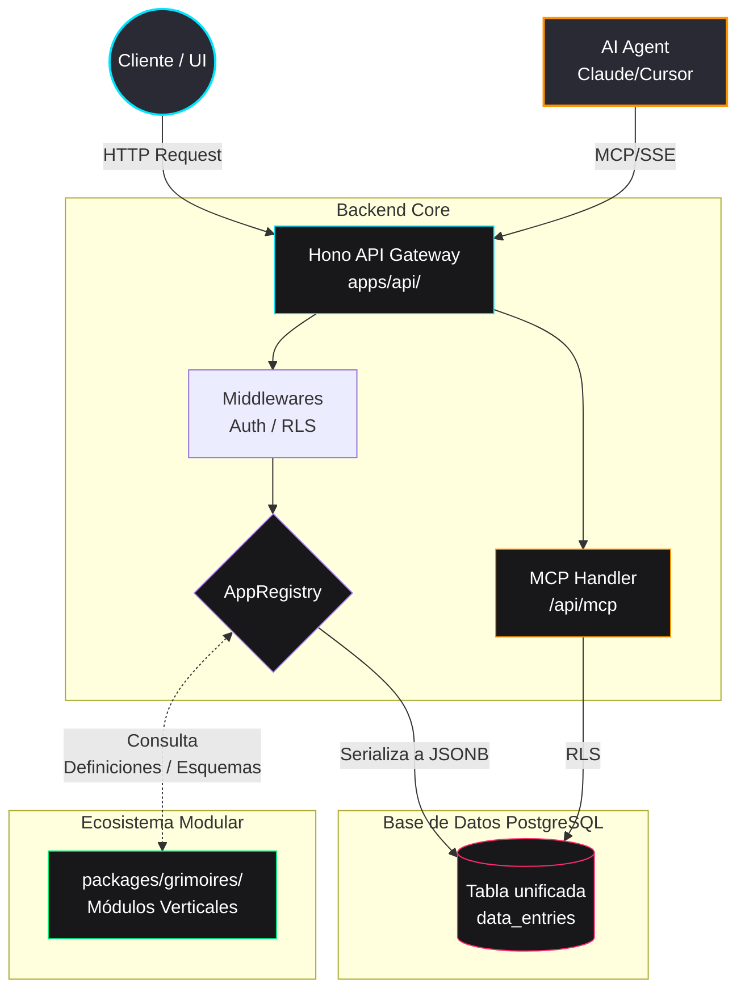
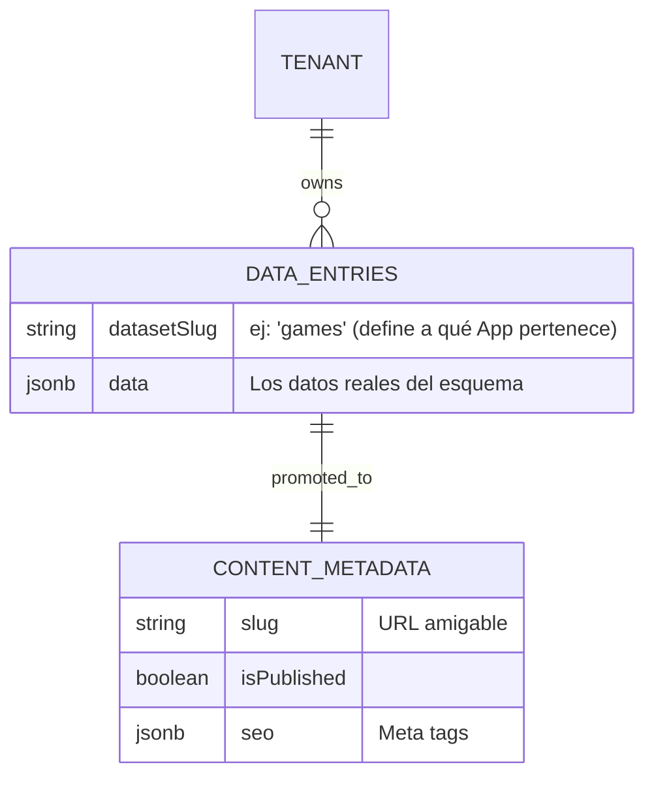

# Arquitectura de GremiusCMS

## Propósito a Vista de Pájaro (El "Por qué" y el "Cómo")
Este documento explica las decisiones de arquitectura de alto nivel del proyecto, cómo organizamos el código y por qué se toman ciertas decisiones técnicas relativas al manejo de datos dinámicos.

## Estructura de Carpetas

- **`apps/api/` (Core):**
  Aquí reside el núcleo de la aplicación. Contiene la API principal construida sobre Bun y Hono, configuraciones globales, middlewares, y la capa de base de datos base (esquemas y migraciones core). Es responsable de proveer las primitivas sobre las que operan los demás módulos y de manejar la seguridad, la autenticación y el enrutamiento principal.

- **`apps/admin/` (Admin UI):**
  Panel de administración construido con React. Permite gestionar datasets, contenido, usuarios, y configuración del sistema.

- **`packages/grimoires/` (Grimorios/Código Mágico):**
  Esta ubicación alberga los grimorios — bloques individuales de código mágico con esquemas y rutas. Cada grimoire es una unidad funcional independiente que proporciona una capacidad específica (juegos, torneos, equipos, etc.). Anteriormente se llamaban "módulos".

- **`packages/realms/` (Reinos/Ecosistemas):**
  Esta ubicación alberga los reinos — ecosistemas de negocio que agrupan grimorios y definen la experiencia visual. Un reino declara qué grimorios están activos mediante su `realm.json`. Anteriormente se llamaban "themes".

- **`packages/mcp-server/` (MCP Server):**
  Implementación del Model Context Protocol para permitir que agentes de IA (Claude, Cursor, etc.) interactúen con Gremius. Expone resources y tools vía SSE.

- **`packages/shared/` (Shared):**
  Esquemas Zod, tipos TypeScript, y utilidades compartidas entre todos los paquetes.

## El Flujo de Datos (Data Flow)

El ciclo vital de la información dentro del entorno de Gremius funciona en un esquema de tres fases:

1. **Entrada por Hono:** 
   Cualquier petición (HTTP, inserción o lectura de contenido) toca primero nuestros endpoints expuestos mediante **Hono**. Aquí ocurren procesos como validación de cabeceras, manejo de tokens y control de rate limiting.
2. **Intercepción por el AppRegistry:**
   El controlador no procesa la lógica pesada por sí mismo, sino que delega la definición al `AppRegistry` (el registro dinámico de grimorios y esquemas del sistema de base de datos). El registro identifica rápidamente las definiciones de esquemas, los campos requeridos, relaciones dinámicas y validaciones pertinentes a ese módulo Vertical en específico.
3. **Persistencia en JSONB (`data_entries`):**
   Una vez que el manejador consolida y valida los datos, en vez de insertarlos en una tabla estricta fuertemente tipada de su entidad, el payload termina guardándose serializado dinámicamente en una columna de formato JSONB dentro de la tabla global de contenido dinámico `data_entries`.

## Model Context Protocol (MCP)

Gremius expone un servidor MCP en `/api/mcp` que permite la integración con agentes de IA:

### Protocolo
- **Versión**: 2024-11-05
- **Transporte**: SSE (Server-Sent Events)
- **Formato**: JSON-RPC 2.0

### Endpoints
```
GET  /api/mcp       # Conexión SSE para recibir eventos
POST /api/mcp       # Envío de mensajes JSON-RPC
```

### Tools Disponibles
| Tool | Descripción |
|------|-------------|
| `gremius_query_dataset` | Query registros con filtros opcionales |
| `gremius_insert_record` | Insertar nuevo registro en dataset |
| `gremius_dispatch_worker` | Encolar trabajo en BullMQ |

### Resources Disponibles
| Resource | URI |
|----------|-----|
| Datasets | `gremius://datasets` |
| Grimoires | `gremius://grimoires` |

## Decisiones Clave (ADR - Architecture Decision Records)

### ADR-001: Persistencia de Modelos Dinámicos
> **Decidimos usar JSONB en data_entries en lugar de crear tablas SQL al vuelo para evitar cuellos de botella en migraciones multi-tenant.**

Mantener un ecosistema dinámico (esencial en un CMS) donde los usuarios pueden cambiar el esquema de los conjuntos de datos sin interactuar activamente con alteraciones `ALTER TABLE` nos permite escalar mucho más rápido, evita bloqueos exclusivos de la base de datos en producción y agiliza las migraciones sin tener una sobrecarga de DDL para cada "Vertical".

### ADR-002: Row-Level Security Nativo de PostgreSQL
> **Implementamos RLS a nivel de base de datos para garantizar aislamiento de datos incluso ante errores de la aplicación o queries generadas por IA.**

Usando `set_config('app.current_user_id', ...)` inyectamos el contexto de usuario en cada transacción, permitiendo que las políticas RLS de PostgreSQL filtren automáticamente los registros. Esto protege contra fugas de datos incluso si la lógica de la aplicación o un agente MCP generan queries incorrectos.

### ADR-003: Model Context Protocol para Agentes de IA
> **Exponemos funcionalidades del CMS vía MCP en lugar de APIs ad-hoc para cada agente.**

El protocolo estándar MCP permite que cualquier agente compatible (Claude Desktop, Cursor, etc.) se conecte a Gremius sin integraciones específicas. El servidor MCP reutiliza el mismo código de la API y respeta las mismas políticas de seguridad (RLS, auth).

---

## Diagrama de Arquitectura de Alto Nivel



---

## Diagrama de Base de Datos (Entity-Relationship)

Dado que la arquitectura vertical no crea tablas SQL estáticas por cada colección, los datos del "Core" viven unificados y relacionados de forma flexible. Aquí visualizamos cómo `content_metadata` (nuestra estructura base para la Épica 2) se vincula y enriquece a la data dinámica genérica almacenada en `data_entries`:


