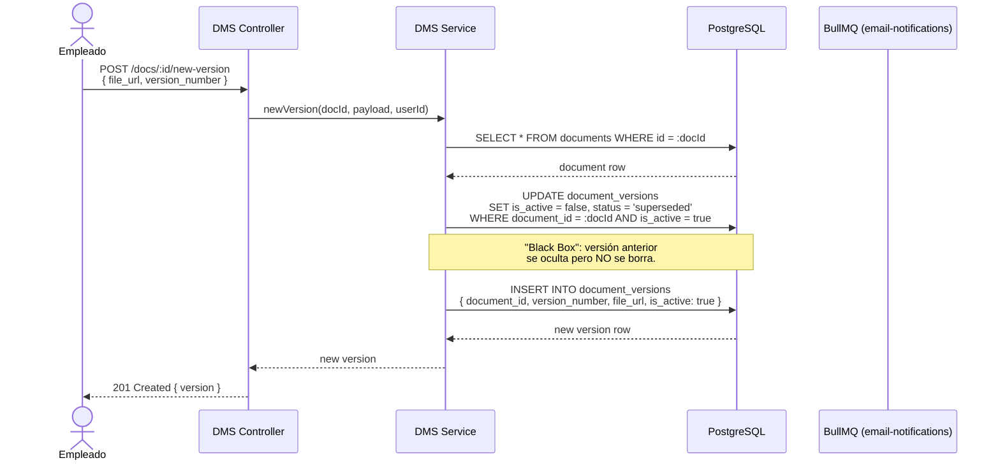
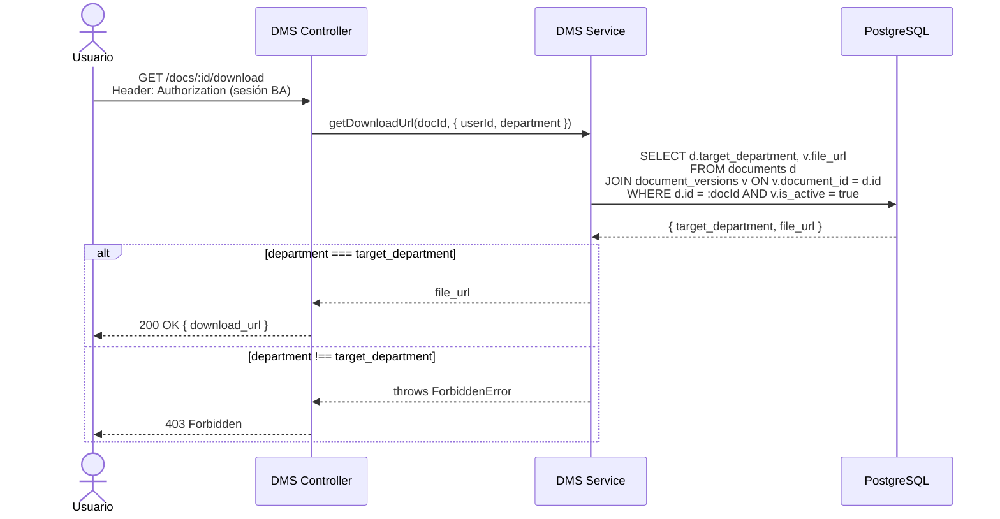
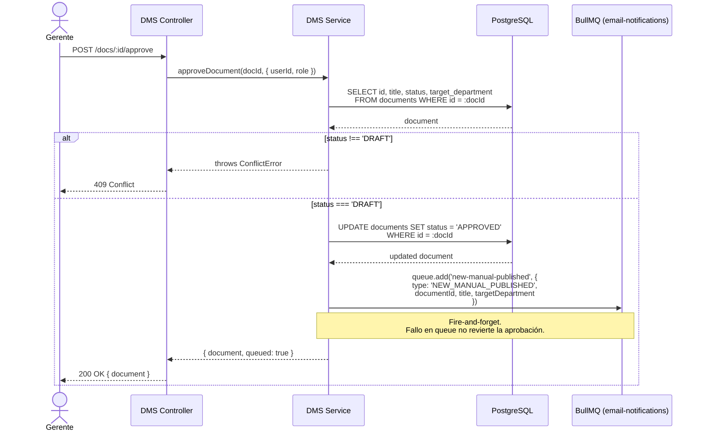

# DMS — Gestor de Manuales: Arquitectura

## Descripción General

El módulo DMS implementa tres flujos críticos de negocio:

1. **Versionamiento "Black Box"** — al subir una nueva versión, la anterior se marca como `superseded` y la nueva se convierte en la versión activa. La versión anterior NO se elimina.
2. **Control de acceso por departamento** — solo los usuarios cuyo `department` coincide con `target_department` del documento pueden descargarlo.
3. **Flujo de aprobación** — un Gerente cambia el estado del documento de `DRAFT` → `APPROVED` y el sistema emite un evento a BullMQ.

---

## Diagrama de Secuencia — Flujo de Nueva Versión

---

## Diagrama de Secuencia — Flujo de Descarga con Control de Acceso

---

## Diagrama de Secuencia — Flujo de Aprobación + BullMQ

---

## Decisiones de Diseño

| Decisión | Justificación |
|---|---|
| `is_active` flag en `document_versions` | Permite "Black Box" sin DELETE — historial completo preservado |
| `role` en el contexto de usuario | Solo `manager` y `admin` pueden aprobar |
| Fire-and-forget en BullMQ | La aprobación en DB es la fuente de verdad; un fallo de queue no la revierte |
| Datos de usuario inyectados en el controller | El service es puro y testeable sin dependencia de Hono |
